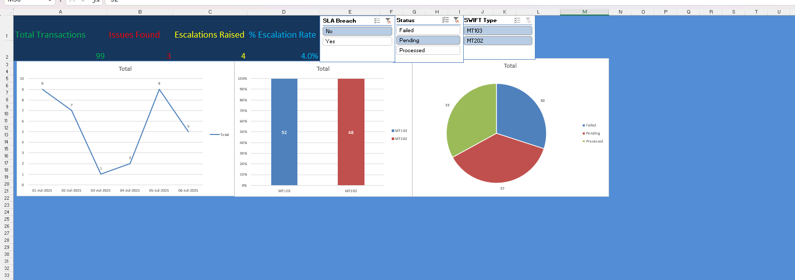
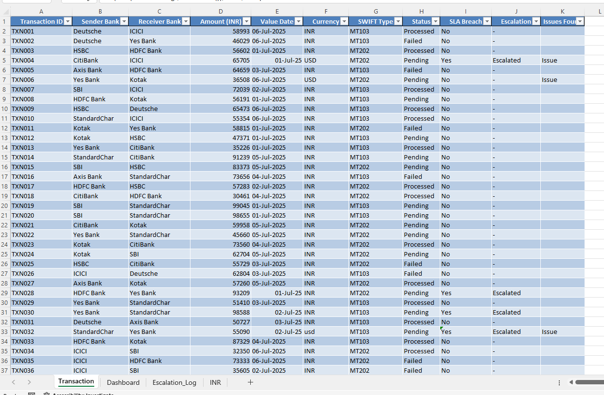
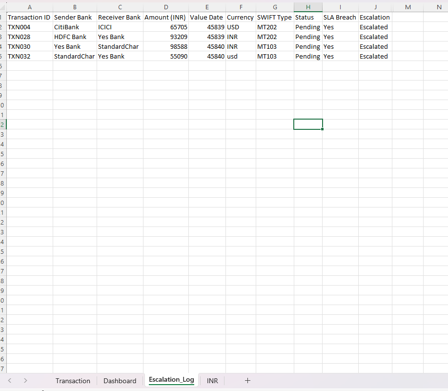

# 💸 SWIFT_MT103_MT202_Transactions – Payment Monitoring Dashboard (Excel)

A complete Excel-based automation project simulating payment transaction monitoring using SWIFT MT103 and MT202 message types. It includes a dynamic dashboard, validation logic, and escalation tracking – ideal for showcasing Excel automation skills for banking operations.

---

## 📁 Files Included

| File Name                             | Description |
|--------------------------------------|-------------|
| `SWIFT_MT103_MT202_Transactions.xlsx` | Main workbook with transaction data, pivot reports, and dashboard |
| `Banking-Payment-Dashboard.png`       | Screenshot of the final interactive dashboard |
| `Banking-Payment-TRANSACTION.png`     | Sample of raw payment transactions |
| `ESCALATION.png`                      | Sample escalation log sheet generated |

---

## 🧩 Problem Statement

Banks process large volumes of interbank transactions using SWIFT protocols (MT103 & MT202). Manual tracking of status, SLA breaches, and escalations can lead to operational delays and compliance risks.

---

## ✅ Solution Provided

This project simulates a real-world banking back-office use case with:
- 🧾 Raw transaction logging
- ⚠️ SLA breach detection using Excel formulas
- 🚨 Escalation tracking for delayed processing
- 📊 Live dashboard using PivotTables, charts, and slicers

---

## 🛠️ Tools & Skills Used

- **Microsoft Excel 2021**
- PivotTables & PivotCharts
- Data Validation & Conditional Formatting
- Dynamic Slicers for SWIFT Type, Status, SLA Breach
- Formula-based automation (e.g., `IF`, `COUNTIF`, `FILTER`)

---

## 📸 Screenshots

### 🔹 Interactive Dashboard

### 🔹 Transaction Sheet

### 🔹 Escalation Log

---

## 🚀 How to Use

1. Open `SWIFT_MT103_MT202_Transactions.xlsx`
2. Navigate through the sheets:
   - `Transaction`: Add or edit payment data
   - `Validation_Log`: Detect issues automatically (optional)
   - `Escalation_Log`: Auto-populates when SLA breach is detected
   - `Dashboard`: Visual summary by Date, SWIFT Type, Status, Escalations
3. Use slicers to interactively filter data.

---

## 📬 Contact

For queries or collaboration, feel free to reach out or fork this repo.  
**Built by:** [Rajathesh2002](https://github.com/Rajathesh2002)

---

## ⭐ GitHub Tagline

`Excel Automation | Banking Domain | SWIFT | SLA Escalation | Dashboard Reporting`

